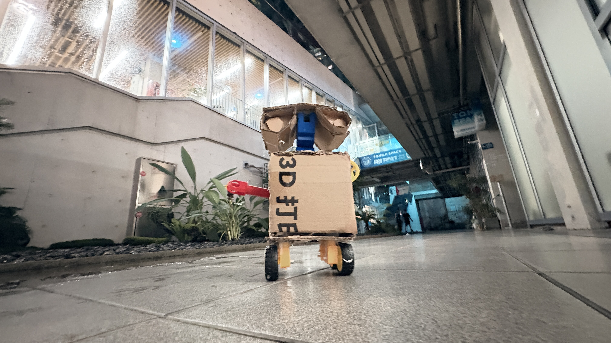
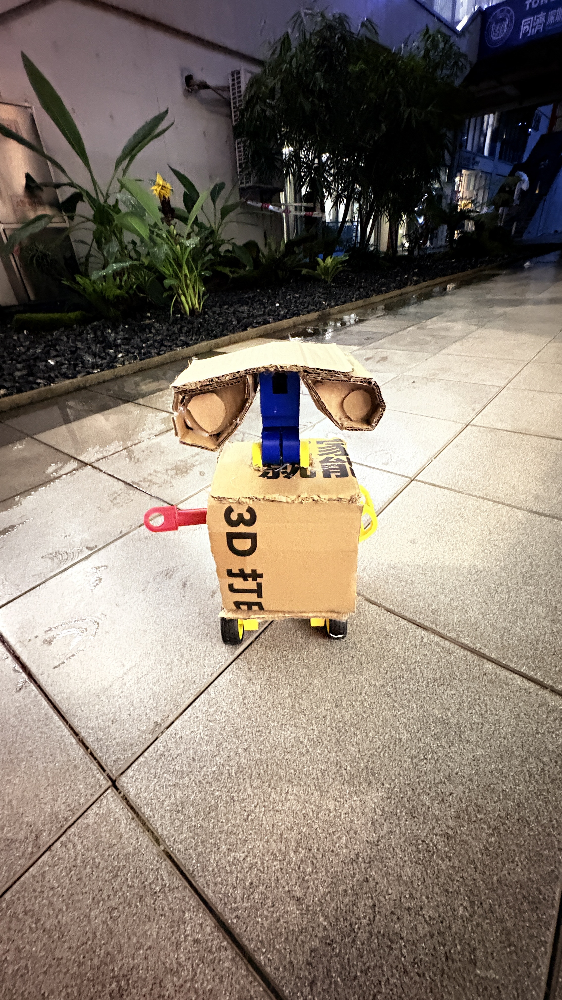
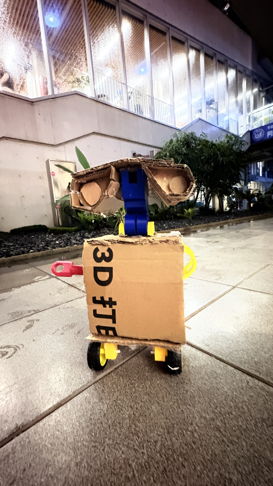
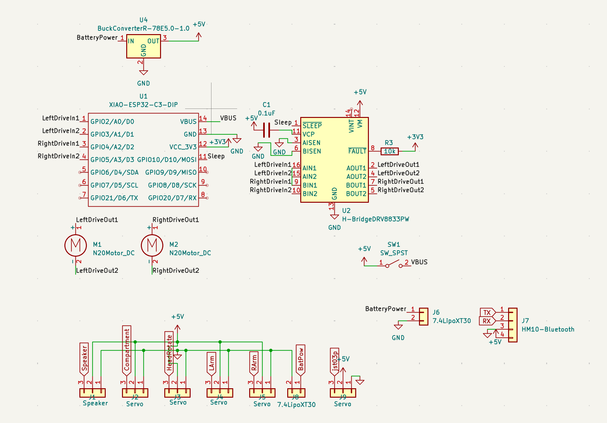
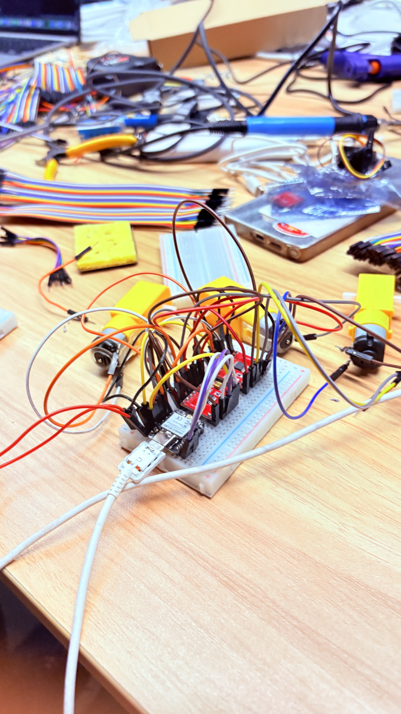
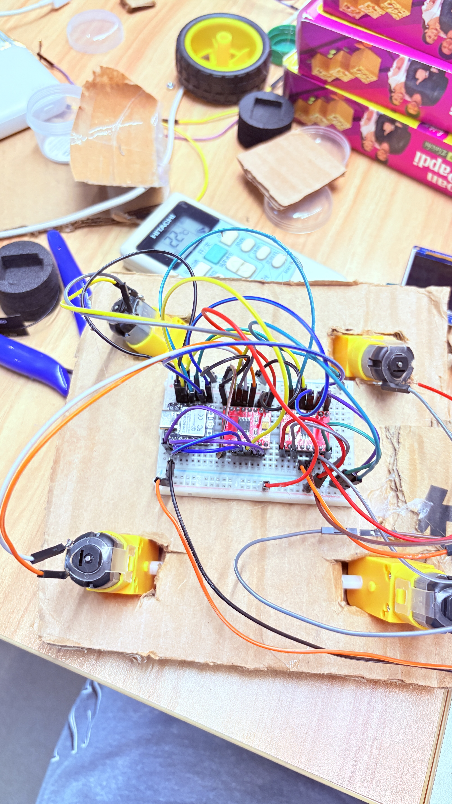

# FALL-E

<replace>with pic of the zine</replace>

---

# The Problem

So the world is ending on the 7th of July and the human species may not survive. Soup, however can survive the incoming apocalypse, but only with help. Soup needs a companion to accompany itself(as soup can't walk) to preserve the legacy of humankind for the next species to rule earth.


---

# What is FALL-E?

FALL-E is a robot inspired by the pixar movie "WALL-E" and is meant to preserve soup and the legacy of the human species after the destruction of the world. It has a tank-drive chassis with two independent tracks(motor on each side).

FALL-E features a Seeed Studio XIAO ESP32C3, 2 DC Motors, and a DRV8833 Motor Driver. 

---

# Why choose FALL-E?

Our team went into this competition wanting to create something to protect soup and preserve humankind's legacy. We started brainstorming ideas that could do that. Ultimately, two avenues presented themselves: one giving soup wweaponry (like a turret) or giving it a form of transportation. We ultimately settled on a robot to keep soup company, protection and a form of transportation. We wanted to base it off of WALL-E because it too was exploring a barren, destroyed earth.


---

## Bill of materials

- BOM: [bom.csv](bom.csv)


---

# IRL Pics







---

# Schematic/Wiring Diagram



---

# How to assemble it(with pics)?

1. Gather your breadboard, wires, & electronic components.
2. Wire the breadboard following the wiring diagram below:

    a. You need to solder with solder & a soldering iron the microcontroller and it's header pins along with the dupont wires with the tt motors

After you do so, the result should look like this:




3. Next up is too make the body. For the main cube inside cut 6 17x17 cm squares. 
    a. Hot Glue 5 of these squares together to make a cube without a side. 
    b. Cut two rectangular shaoed holes around 3cm away from each other in the middle.
    c. 3D Print `CAD/part2.stl`and from the inside of the cube force it up:
    

# How to use it?

## Flash XIAO ESP32-C3

1. Plug in the XIAO by USB-C.
2. In `code/esp32code/main.cpp`, set:
   ```cpp
   constexpr char kWifiSsid[] = "YOUR_WIFI";
   constexpr char kWifiPassword[] = "YOUR_PASSWORD";
   ```
3. Build:
   ```bash
   python3 -m platformio run
   ```
4. Flash:
   ```bash
   python3 -m platformio run --target upload --upload-port /dev/cu.usbmodem101
   ```
5. Open serial monitor:
   ```bash
   python3 -m platformio device monitor -b 115200
   ```

## Connect RC

1. Read the IP from serial output.
2. If Wi-Fi fails, connect to `FalloutESP32`.
3. Open `code/esp32code/web_controller.html` in a browser.
4. Connect to:
   ```text
   ws://XIAO_IP:3333/
   ```
   or fallback:
   ```text
   ws://192.168.4.1:3333/
   ```
5. Use the two joysticks to control left/right motors.
